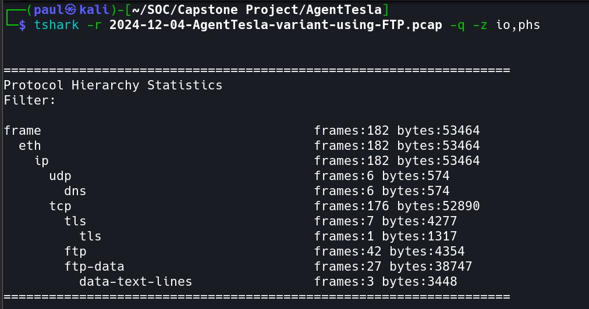
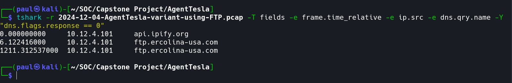
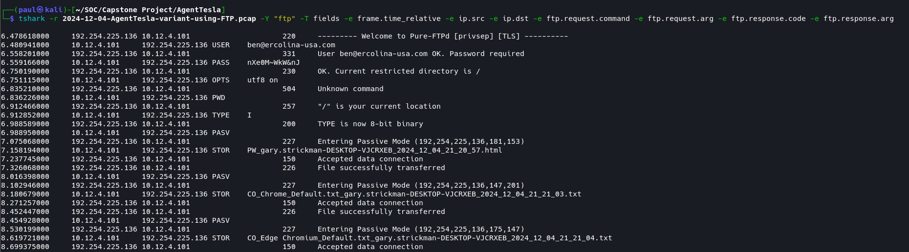
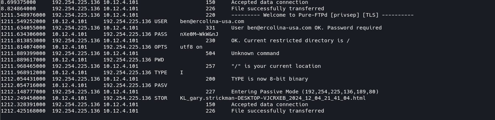
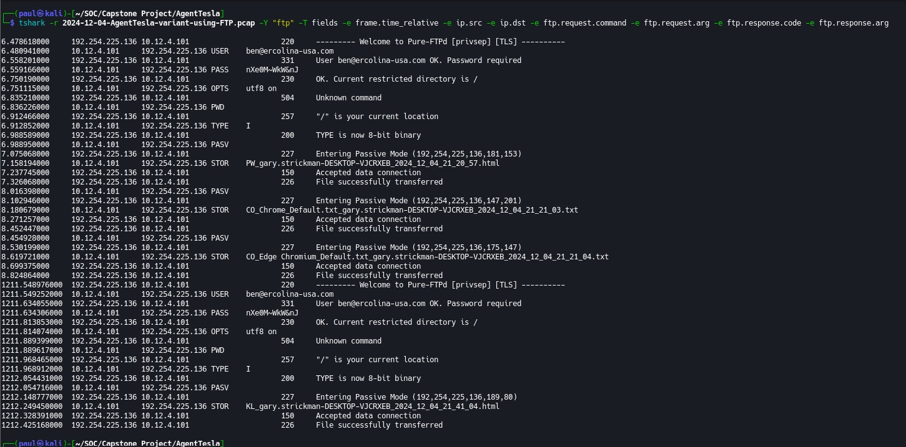
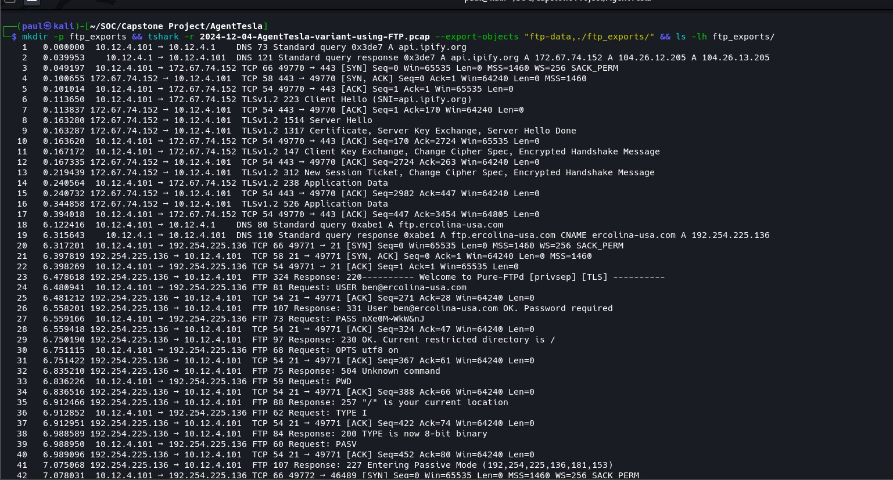
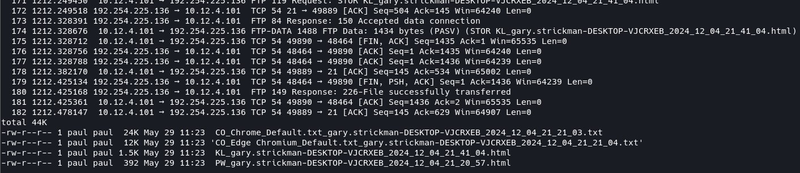
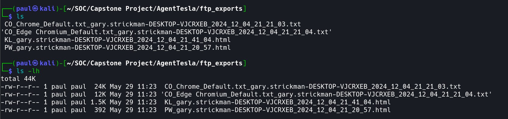

# NETWORK INVESTIGATION REPORT

**AgentTesla FTP Exfiltration — Globex Manufacturing Ltd.**
CONFIDENTIAL | SOC ANALYSIS REPORT | TLP:RED

| Field | Value |
|---|---|
| Organisation | Globex Manufacturing Ltd. |
| Incident Date | December 4, 2024 |
| Report Author | Ukah Paul — SOC Analyst |
| Evidence File | 2024-12-04-AgentTesla-variant-using-FTP.pcap |
| Tools Used | tshark, Wireshark |
| Suspected Malware | AgentTesla: Information Stealer |

> ⚠ **CRITICAL — Active Exfiltration Confirmed**
> AgentTesla malware executed on host DESKTOP-VJCRXEB (10.12.4.101). The malware performed public IP reconnaissance, resolved a hardcoded FTP C2 server, and exfiltrated four files containing browser credentials and keylog data over cleartext FTP (port 21). Total data stolen: ~38 KB across 2 automated sessions.

---

## 01 | INFECTED HOST IDENTIFICATION

### Protocol Distribution — Traffic Overview

The PCAP capture spans 182 frames (53,464 bytes). FTP dominates — 42 control frames and 27 data frames confirm active file exfiltration, not routine browsing or update traffic.

| Protocol | Frames | Bytes | Significance |
|---|---|---|---|
| Total (All) | 182 | 53,464 | Full capture scope |
| DNS (UDP) | 6 | 574 | 3 queries + 3 responses — minimal, deliberate |
| TLS (HTTPS) | 7 | 4,277 | Single HTTPS session — public IP lookup via api.ipify.org |
| FTP Control | 42 | 4,354 | 2 complete sessions on port 21 — cleartext credentials |
| FTP Data | 27 | 38,747 | 4 files exfiltrated — ~38 KB of stolen data |

**[Screenshot: Protocol Hierarchy Overview]**

> Source: `screenshots/Protocol Hierarchy Overview`

### IP Conversation Analysis

| IP Address | Role | Frames | Justification |
|---|---|---|---|
| 10.12.4.101 | VICTIM — Infected Workstation | 157 | Sole internal host; initiates all DNS queries and both FTP sessions |
| 192.254.225.136 | ATTACKER — FTP Exfil Server | 157 | Receives all STOR uploads; resolved from ftp.ercolina-usa.com |
| 10.12.4.1 | Internal DNS / Gateway | 6 | Responds to DNS queries only — no suspicious behaviour |
| 172.67.74.152 | api.ipify.org (Cloudflare) | 19 | Victim public IP lookup — HTTPS; first contact post-execution |

**[Screenshot: IP Conversation Results]**
.jpg)
> Source: `screenshots/Identify All Hosts (IP Conversation Table)`

### Confirmed Victim Profile

| Property | Value | Evidence Source |
|---|---|---|
| Victim IP Address | **10.12.4.101** | tshark conv,ip — highest volume internal IP |
| Victim Hostname | DESKTOP-VJCRXEB | AgentTesla exfil filenames — embedded by malware |
| OS Username | gary.strickman | AgentTesla exfil filenames — embedded by malware |
| Operating System | Microsoft Windows 11 Pro | PW_ exfil file content header |
| CPU | Intel Core i7-14700K | PW_ exfil file content header |
| RAM | 16,383 MB | PW_ exfil file content header |
| Victim Public IP | **173.66.46.97** | Returned by api.ipify.org at T+0 |

### First Signs of Compromise

| Offset | Absolute Time (UTC) | Event | Significance |
|---|---|---|---|
| T+0.000s | 21:20:50 | DNS → api.ipify.org | First packet from victim — malware fingerprinting external IP |
| T+0.050s | 21:20:50 | TLS session → 172.67.74.152 | Victim public IP (173.66.46.97) returned to malware |
| T+6.122s | 21:20:56 | DNS → ftp.ercolina-usa.com | C2/exfil server resolution begins |
| T+6.317s | 21:20:56 | TCP SYN → 192.254.225.136:21 | FTP Session 1 initiated — exfiltration imminent |

---

## 02 | DNS FINDINGS

> ⚠ **Key Observation**
> Only 3 DNS queries in 20+ minutes — zero background noise. This confirms the workstation was running only AgentTesla during the capture window. Every query was deliberate and malware-driven.

### DNS Query Log — All Queries from Victim (10.12.4.101)

| Rel. Time | Source IP | Domain Queried | Purpose / MITRE |
|---|---|---|---|
| T+0.000s | 10.12.4.101 | api.ipify.org | Public IP discovery before exfil — MITRE T1016 |
| T+6.122s | 10.12.4.101 | ftp.ercolina-usa.com | FTP exfil server — Session 1 about to open |
| T+1211.313s | 10.12.4.101 | ftp.ercolina-usa.com | FTP re-resolution — Session 2 beacon (~20 min interval) |

**[Screenshot: DNS Query Extraction]**

> Source: `screenshots/Extract DNS Queries`

### DNS Response Analysis: Resolved IPs

| Domain Queried | Resolved IP(s) | Analysis |
|---|---|---|
| api.ipify.org | 172.67.74.152 / 104.26.12.205 / 104.26.13.205 | Legitimate public IP service — abused by AgentTesla to profile network location pre-exfiltration |
| **ftp.ercolina-usa.com** | **192.254.225.136** | **Attacker-controlled FTP server — receives all stolen data** |

**[Screenshot: DNS Response Extraction]**
.jpg)
> Source: `screenshots/Extract DNS Responses (Domain → IP Resolution)`

### DNS Analyst Summary

- Only 3 DNS queries; no browser activity or software update noise; confirms isolated malware-only execution.
- api.ipify.org queried at T+0 before any FTP connection — documented AgentTesla first action: discover external IP, embed in exfil metadata.
- ftp.ercolina-usa.com queried exactly twice, once per FTP session; consistent with AgentTesla re-resolving before each beacon.
- 1,211-second gap between the two ftp.ercolina-usa.com queries confirms the ~20-minute automated beacon interval.
- No DGA (Domain Generation Algorithm) patterns detected — AgentTesla uses a hardcoded C2 configuration.

---

## 03 | FTP TRAFFIC ANALYSIS

> ⚠ **DATA EXFILTRATION CONFIRMED — Cleartext FTP Port 21**
> AgentTesla transmitted all stolen credentials and keylog data over unencrypted FTP. Every command — including the FTP username and password — is visible in plain text on the wire. All four exfiltrated files have been recovered from the PCAP.

### FTP Server Profile

| Property | Value |
|---|---|
| FTP Server Domain | ftp.ercolina-usa.com |
| FTP Server IP | 192.254.225.136 |
| FTP Port | 21 — Cleartext, NO TLS encryption |
| Server Software | Pure-FTPd [privsep] [TLS] — banner exposed in 220 responses |
| FTP Username | ben@ercolina-usa.com — transmitted in cleartext USER command |
| FTP Password | [REDACTED — visible in cleartext PASS command] |
| Total Sessions | 2 (Session 1 at T+6s, Session 2 at T+1,211s) |
| Total Files Exfiltrated | 4 files across both sessions |
| Total Data Volume | ~38 KB of stolen credentials and keylog data |

### Session 1 — Full Command Reconstruction (T+6s to T+9s)

FTP runs entirely in cleartext. The following control channel exchange was reconstructed verbatim from tshark field output.

| Time | Direction | Command / Response | Significance |
|---|---|---|---|
| T+6.317s | Server → Client | 220 Welcome to Pure-FTPd [privsep] [TLS] | FTP server banner — server software fingerprinted |
| T+6.480s | Client → Server | USER ben@ercolina-usa.com | ⚠ Attacker FTP username — cleartext |
| T+6.558s | Server → Client | 331 Password required for ben@ercolina-usa.com | Server confirms username accepted |
| T+6.559s | Client → Server | PASS [REDACTED] | ⚠ Password transmitted cleartext on port 21 |
| T+6.750s | Server → Client | 230 OK — Current restricted directory is / | Login successful — exfiltration begins |
| T+6.988s | Server → Client | 200 TYPE is now 8-bit binary | Binary transfer mode set |
| T+7.158s | Client → Server | STOR PW_gary.strickman-DESKTOP-VJCRXEB_2024_12_04_21_20_57.html | ⚠ Password dump uploaded — 392 bytes |
| T+7.326s | Server → Client | 226 File successfully transferred | Password dump confirmed on attacker server |
| T+8.180s | Client → Server | STOR CO_Chrome_Default.txt_...2024_12_04_21_21_03.txt | ⚠ Chrome credentials uploaded — ~23 KB |
| T+8.452s | Server → Client | 226 File successfully transferred | Chrome data confirmed on attacker server |
| T+8.619s | Client → Server | STOR CO_Edge Chromium_Default.txt_...2024_12_04_21_21_04.txt | ⚠ Edge credentials uploaded — ~11 KB |
| T+8.824s | Server → Client | 226 File successfully transferred | Edge data confirmed; Session 1 closing |
| T+9.1s | Client → Server | QUIT | FTP Session 1 closed cleanly |

**[Screenshot: FTP Session 1 — Full Command Reconstruction]**

> Source: `screenshots/Reconstruct Full FTP Session 1`

### Session 2 — Keylog Upload (T+1,211s — ~20 min later)

Twenty minutes after Session 1, AgentTesla opened a second FTP session to upload keylog data captured during the intervening period. The same hardcoded credentials were reused — consistent with AgentTesla's documented beacon behaviour.

| Time | Direction | Command / Response | Significance |
|---|---|---|---|
| T+1211.548s | Server → Client | 220 Welcome to Pure-FTPd [privsep] [TLS] | Session 2 opens — same server, same banner |
| T+1211.549s | Client → Server | USER ben@ercolina-usa.com | Same attacker credentials reused — cleartext |
| T+1211.634s | Client → Server | PASS [REDACTED] | ⚠ Password again in cleartext — no rotation |
| T+1211.813s | Server → Client | 230 OK | Login successful — Session 2 exfiltration begins |
| T+1212.249s | Client → Server | STOR KL_gary.strickman-DESKTOP-VJCRXEB_2024_12_04_21_41_04.html | ⚠ Keylog uploaded — ~1.4 KB of captured keystrokes |
| T+1212.425s | Server → Client | 226 File successfully transferred | Keylog confirmed on attacker server — Session 2 complete |

**[Screenshot: FTP Session 2 — Keylog Upload]**

> Source: `screenshots/Reconstruct Full FTP Session 2`
> (See also combined view below: `Reconstruct Full FTP Sessions full session`)

### Exfiltrated Files: All 4 Recovered from PCAP

| Module | Filename | Size | Content |
|---|---|---|---|
| PW_ | PW_gary.strickman-DESKTOP-VJCRXEB_2024_12_04_21_20_57.html | 392 B | Saved browser passwords from Edge — formatted as HTML |
| CO_ | CO_Chrome_Default.txt_gary.strickman-DESKTOP-VJCRXEB_2024_12_04_21_21_03.txt | ~23 KB | Chrome saved credentials and session cookie store |
| CO_ | CO_Edge Chromium_Default.txt_gary.strickman-DESKTOP-VJCRXEB_2024_12_04_21_21_04.txt | ~11 KB | Edge Chromium credentials and cookie store |
| KL_ | KL_gary.strickman-DESKTOP-VJCRXEB_2024_12_04_21_41_04.html | ~1.4 KB | 20 minutes of captured keystrokes — HTML format |

**[Screenshot: Exfiltrated File Recovery]**

> Source: `screenshots/Recover Exfiltrated Files from PCAP 1a` and `...1b`
> Also relevant: `screenshots/exfiltrated files from PCAP`

### AgentTesla Filename Convention — Decoded

| Component | Example Value | Meaning |
|---|---|---|
| PREFIX_ | PW_ / CO_ / KL_ | Module: PW=Password \| CO=Cookie/Credential \| KL=Keylog |
| username | gary.strickman | Windows username — harvested at runtime by malware |
| -HOSTNAME | DESKTOP-VJCRXEB | Windows machine name — harvested at runtime |
| _YYYY_MM_DD | 2024_12_04 | Collection date — embedded by malware |
| _HH_MM_SS | 21_20_57 | Collection timestamp — precise to the second |
| .html / .txt | .html / .txt | File format of exfiltrated data |

---

## 04 | IOC TABLE — NETWORK-BASED INDICATORS

### 4.1 Host Indicators

| IOC Type | Value | Source | Confidence |
|---|---|---|---|
| Victim IP Address | 10.12.4.101 | tshark conv,ip | HIGH |
| Victim Hostname | DESKTOP-VJCRXEB | AgentTesla exfil filename | HIGH |
| Victim OS Username | gary.strickman | AgentTesla exfil filename | HIGH |
| Victim OS | Microsoft Windows 11 Pro | PW_ exfil file header | HIGH |
| Victim Public IP | 173.66.46.97 | api.ipify.org response | HIGH |

### 4.2 DNS & Domain Indicators

| IOC Type | Value | Source | Confidence |
|---|---|---|---|
| Domain — IP Discovery | api.ipify.org | tshark DNS — T+0.000s | HIGH |
| IP — api.ipify.org CDN | 172.67.74.152 | tshark DNS response | MED |
| Domain — FTP C2 | ftp.ercolina-usa.com | tshark DNS — T+6.122s & T+1211.313s | HIGH |
| IP — FTP Exfil Server | 192.254.225.136 | tshark DNS + conv,ip | HIGH |
| C2 Beacon Interval | ~20 min (1,211 seconds) | DNS re-query timestamp delta | HIGH |

### 4.3 FTP & Credential Indicators

| IOC Type | Value | Source | Confidence |
|---|---|---|---|
| FTP Server Domain | ftp.ercolina-usa.com | tshark DNS + FTP stream | HIGH |
| FTP Server IP | 192.254.225.136 | tshark conv,ip + FTP stream | HIGH |
| FTP Port | 21 — Cleartext, No Encryption | tshark FTP filter | HIGH |
| FTP Server Banner | Pure-FTPd [privsep] | FTP 220 response | HIGH |
| FTP Username | ben@ercolina-usa.com | FTP USER command — cleartext | HIGH |
| FTP Password | [REDACTED — cleartext on wire] | FTP PASS command | HIGH |

### 4.4 Exfiltrated File Indicators

| Filename | Size | Module | Session |
|---|---|---|---|
| PW_gary.strickman-DESKTOP-VJCRXEB_2024_12_04_21_20_57.html | 392 B | Password Harvester | 1 |
| CO_Chrome_Default.txt_gary.strickman-DESKTOP-VJCRXEB_2024_12_04_21_21_03.txt | ~23 KB | Browser Stealer | 1 |
| CO_Edge Chromium_Default.txt_gary.strickman-DESKTOP-VJCRXEB_2024_12_04_21_21_04.txt | ~11 KB | Browser Stealer | 1 |
| KL_gary.strickman-DESKTOP-VJCRXEB_2024_12_04_21_41_04.html | ~1.4 KB | Keylogger | 2 |

---

## 05 | FULL ATTACK TIMELINE

### Phase Overview

| Phase | Time Window | Duration | Key Events |
|---|---|---|---|
| Email Delivery | 12:51 UTC, Dec 4 | — | Phishing email (PURCHASE QUOTATION) from sertan@acronas.com.tr (94.141.120.32) |
| Execution | ~21:20 UTC, Dec 4 | — | Victim opens TECHNICAL SPECIFICATIONS.TAR → executes .exe |
| Reconnaissance | T+0s to T+6s | 6 seconds | Public IP via api.ipify.org; FTP C2 resolved via DNS |
| Session 1 — Exfil | T+6s to T+9s | ~3 seconds | Browser passwords, Chrome & Edge credentials — 3 files, ~35 KB |
| Keylogging Window | T+9s to T+1211s | ~20 minutes | AgentTesla keylogger silently capturing victim keystrokes |
| Session 2 — Exfil | T+1211s to T+1212s | ~2 seconds | Keylog uploaded — 1 file, ~1.4 KB; capture ends |

### Complete Event-by-Event Timeline

| # | Rel. Time | Abs. Time (UTC) | Event | MITRE | Evidence |
|---|---|---|---|---|---|
| 1 | — | 12:51:16 Dec 4 | Phishing email received — PURCHASE QUOTATION lure | T1566.001 | Email header Received: timestamp |
| 2 | — | ~21:20 Dec 4 | Victim opens TAR → executes TECHNICAL SPECIFICATIONS.exe | T1204.002 | Phase 1 analysis |
| 3 | T+0.000s | 21:20:50 | AgentTesla executes — DNS: api.ipify.org (IP discovery) | T1016 | tshark DNS frame 1 |
| 4 | T+0.050s | 21:20:50 | TLS → 172.67.74.152 — victim public IP returned | T1016 | tshark TLS frames 2–10 |
| 5 | T+6.122s | 21:20:56 | DNS: ftp.ercolina-usa.com — C2 server resolution | T1071.002 | tshark DNS frames 18–19 |
| 6 | T+6.317s | 21:20:56 | TCP SYN → 192.254.225.136:21 — FTP Session 1 opens | T1071.002 | tshark FTP frame 20 |
| 7 | T+6.480s | 21:20:57 | FTP USER ben@ercolina-usa.com — cleartext | T1071.002 | tshark FTP USER cmd |
| 8 | T+6.559s | 21:20:57 | FTP PASS — password cleartext on port 21 | T1071.002 | tshark FTP PASS cmd |
| 9 | T+6.750s | 21:20:57 | FTP 230 Login OK — exfiltration window opens | T1041 | tshark FTP 230 |
| 10 | T+7.158s | 21:20:57 | STOR PW_*.html — browser passwords (392 B) | T1555 | tshark STOR + export-objects |
| 11 | T+7.326s | 21:20:57 | 226 Transfer complete — PW_ file confirmed on server | T1041 | tshark FTP 226 |
| 12 | T+8.180s | 21:20:58 | STOR CO_Chrome_*.txt — Chrome credentials (~23 KB) | T1555.003 | tshark STOR + export-objects |
| 13 | T+8.452s | 21:20:58 | 226 Transfer complete — Chrome data confirmed | T1041 | tshark FTP 226 |
| 14 | T+8.619s | 21:20:59 | STOR CO_Edge_*.txt — Edge credentials (~11 KB) | T1555.003 | tshark STOR + export-objects |
| 15 | T+8.824s | 21:20:59 | 226 Transfer complete — Edge data confirmed; Session 1 QUIT | T1041 | tshark FTP 226 + QUIT |
| 16 | T+9s–T+1211s | 21:21–21:41 | AgentTesla keylogger active — 20 min of victim keystrokes | T1056.001 | KL_ file timestamp gap |
| 17 | T+1211.313s | 21:41:01 | DNS re-query: ftp.ercolina-usa.com — Session 2 beacon | T1020 | tshark DNS frame 143 |
| 18 | T+1211.548s | 21:41:02 | TCP SYN → 192.254.225.136:21 — FTP Session 2 opens | T1071.002 | tshark FTP Session 2 SYN |
| 19 | T+1211.549s | 21:41:02 | FTP USER + PASS — same credentials reused cleartext | T1071.002 | tshark FTP Session 2 auth |
| 20 | T+1211.813s | 21:41:02 | 230 Login OK — Session 2 exfiltration begins | T1041 | tshark FTP 230 Session 2 |
| 21 | T+1212.249s | 21:41:04 | STOR KL_*.html — 20 min keylog data (~1.4 KB) | T1056.001 | tshark STOR + export-objects |
| 22 | T+1212.425s | 21:41:04 | 226 Transfer complete — keylog on attacker server; FINAL FRAME | T1020 | tshark FTP 226 — last frame |

### 4.5 MITRE ATT&CK Mapping

| Tactic | Technique | ID | Evidence |
|---|---|---|---|
| Discovery | System Network Configuration Discovery | T1016 | api.ipify.org queried at T+0 — public IP retrieved before exfil |
| Discovery | System Information Discovery | T1082 | Hostname + username auto-embedded in every exfil filename |
| Collection | Input Capture: Keylogging | T1056.001 | KL_ file — 20 min HTML keylog dump of victim keystrokes |
| Collection | Credentials from Web Browsers | T1555.003 | CO_Chrome_ and CO_Edge_ files — browser credential stores stolen |
| Collection | Credentials from Password Stores | T1555 | PW_ file — saved browser password vault extracted |
| C2 | Application Layer Protocol: FTP | T1071.002 | Port 21 used as C2 channel — cleartext, no encryption |
| Exfiltration | Exfiltration Over C2 Channel | T1041 | All stolen data uploaded via FTP STOR to 192.254.225.136 |
| Exfiltration | Automated Exfiltration | T1020 | Two timed sessions; consistent 20-min interval; no user interaction |

---

*SOC Analyst: Ukah Paul | Incident Date: December 4, 2024 | TLP:RED*

---

## Screenshot Index (shared `screenshots/` folder)

| Screenshot filename in folder | Used in section |
|---|---|
| exfiltrated files from PCAP | 03 — Exfiltrated File Recovery (cross-ref) |
| Extract DNS Queries | 02 — DNS Query Extraction |
| Extract DNS Responses (Domain → IP Resolution) | 02 — DNS Response Extraction |
| Identify All Hosts (IP Conversation Table) | 01 — IP Conversation Results |
| Protocol Hierarchy Overview | 01 — Protocol Hierarchy Overview |
| Reconstruct Full FTP Session 1 | 03 — Session 1 Full Command Reconstruction |
| Reconstruct Full FTP Session 2 | 03 — Session 2 Keylog Upload |
| Reconstruct Full FTP Sessions full session | 03 — combined reference |
| Recover Exfiltrated Files from PCAP 1a | 03 — Exfiltrated File Recovery |
| Recover Exfiltrated Files from PCAP 1b | 03 — Exfiltrated File Recovery |

> **Note:** Replace the placeholder image links above (e.g. `screenshots/Protocol Hierarchy Overview.jpg`) with the actual exported screenshot files once copied into the same directory as this markdown file, keeping filenames consistent or updating the links to match.
