# 🛡️ SOC Challenges — Hands-On Security Lab Portfolio

> Practical SOC analysis challenges completed as part of the **Cloud Security Track** at **AltSchool Africa**.  
> Each challenge is documented with the exact commands used, terminal output, reasoning, and findings — not just answers.

---

## 👤 About

**Analyst:** Paul (Jadefox) — `ukahip`  
**Track:** Cloud Security — AltSchool Africa  
**Focus:** Blue Team | Network Forensics | Threat Analysis | Incident Response  
**Primary Platform:** Kali Linux

---

## 📁 Repository Structure

```
soc-challenges/
│
├── 01_Email_and_Phishing_Analysis/
│   └── ...
│
├── 02_Network_Security/
│   └── 02_Wireshark/
│       └── Challenges/
│           ├── wireshark_challenge_1/
│           │   ├── README.md
│           │   ├── report.pdf
│           │   └── screenshots/
│           └── ...
│
└── README.md
```

---

## ✅ Completed Challenges

| # | Category | Challenge | Platform | Status |
|---|---|---|---|---|
| 01 | Network Security | [Wireshark Challenge 1](#-wireshark-challenge-1--malwarecube-soc101) | MalwareCube SOC101 | ✅ Complete |
| 02 | Email & Phishing Analysis | Coming soon | — | 🔄 In Progress |

---

## 🔬 Wireshark Challenge 1 — MalwareCube SOC101

> **Scenario:** The SOC at BulbaTech Innovations received an alert of abnormal traffic patterns  
> and a high number of repeated queries originating from one of their external-facing endpoints (`172.16.1.16`).  
> Analyse the packet capture and produce findings for the report questions.

### Challenge Details

| Field | Value |
|---|---|
| **Source** | MalwareCube SOC101 |
| **Capture File** | `wireshark_challenge.pcap` |
| **Endpoint** | `172.16.1.16` |
| **Tools Used** | `tshark` · `xxd` · `sha256sum` · `capinfos` · `VirusTotal` |
| **Platform** | Kali Linux (CLI only — no GUI) |

---

### 🔍 Methodology

Every question was answered using **tshark** — the CLI version of Wireshark on Kali Linux.  
No GUI. Just the terminal, precise filters, and piped commands.

The approach for each question followed this structure:
1. **Command** — the exact CLI command used
2. **How It Works** — why this command, what each flag does
3. **Terminal Output** — raw results from Kali
4. **Answer** — the derived finding

---

### Q1 — How many total packets are in the capture?

**Command:**
```bash
capinfos wireshark_challenge.pcap | grep "Number of packets"
```

**How It Works:**  
`capinfos` reads the PCAP global header and reports file-level statistics without parsing every packet. It is faster and more accurate than `tshark | wc -l`, which can miscount truncated or malformed packets. `grep` filters the output to the single relevant line.

**Screenshot:**

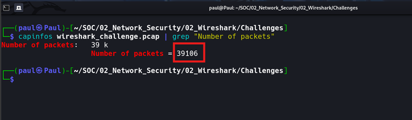

**Answer:** `39,106 packets`

---

### Q2 — What was the first domain name queried and resolved?

**Command:**
```bash
tshark -r wireshark_challenge.pcap \
  -Y "dns.flags.response == 1" \
  -T fields \
  -e frame.number \
  -e dns.qry.name \
  -e dns.a \
  | head -20
```

**How It Works:**  
`dns.flags.response == 1` isolates DNS response packets — server replies where a query was successfully answered. `dns.qry.name` extracts the queried domain and `dns.a` extracts the returned IPv4 A record. The very first row is the earliest resolved domain in the entire capture.

> 💡 A *resolved* query means a valid A record was returned — not an NXDOMAIN error. That distinction matters here.

**Screenshot:**

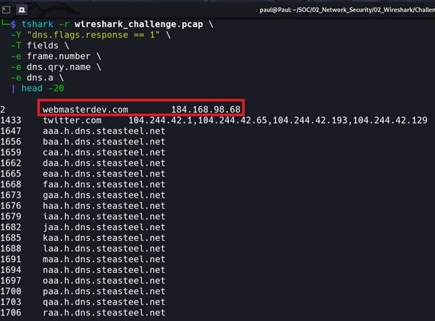

**Answer:** `webmasterdev.com`

---

### Q3 — What is the associated IP address of that domain?

The IP address is returned in the same command output as Q2 — the `dns.a` field in the same row as `webmasterdev.com`.

**Screenshot:**


**Answer:** `184.168.98.68`

---

### Q4 — How many HTTP packets are in the capture?

**Command:**
```bash
tshark -r wireshark_challenge.pcap -Y "http" | wc -l
```

**How It Works:**  
The `http` display filter matches any packet containing an HTTP layer — GET requests, POST requests, server responses, and continuation frames. Piping to `wc -l` counts each matched packet as one line. This is more precise than filtering `tcp.port == 80`, which matches raw TCP on port 80 even before the HTTP handshake.

**Screenshot:**

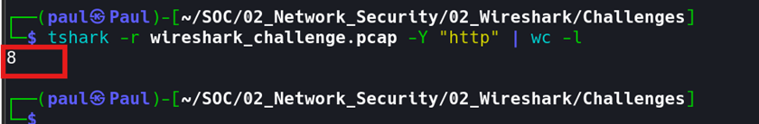

**Answer:** `8 packets`

---

### Q5 — What is the relative path the victim accessed to download a file?

**Command:**
```bash
tshark -r wireshark_challenge.pcap \
  -Y "http.request" \
  -T fields \
  -e http.request.method \
  -e http.request.uri \
  -e http.host
```

**How It Works:**  
`http.request` isolates outbound HTTP request packets. `http.request.uri` extracts the relative path — everything after the hostname in the URL. `http.host` shows the destination. Together these reveal exactly what the victim's machine requested and from where.

**Screenshot:**

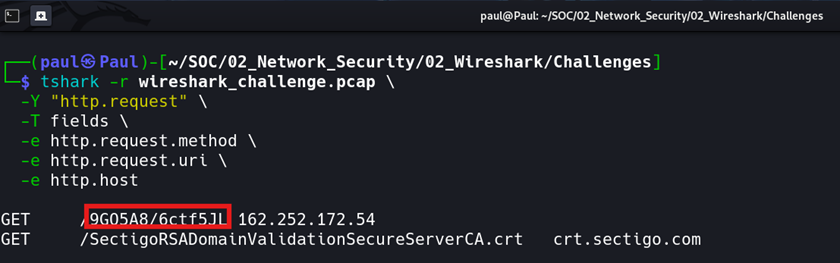

**Answer:** `/9GQ5A8/6ctf5JL`

> 🚩 Three red flags in one request: obfuscated path with no file extension, served from a bare IP address with no domain name, deliberately bypassing URL reputation checks.

---

### Q6 — What file type does the server claim the file to be?

**Command:**
```bash
tshark -r wireshark_challenge.pcap \
  -Y "http.response" \
  -T fields \
  -e http.content_type
```

**How It Works:**  
When a server responds to a GET request it includes a `Content-Type` header declaring the file's MIME type. Attackers frequently manipulate this header to disguise malware as benign files. `http.response` isolates server reply packets and `http.content_type` extracts that specific header value.

> 💡 The `Content-Type` header is a declaration, not a guarantee. Any server can claim any type — which is why we verify with magic bytes in Q7.

**Screenshot:**

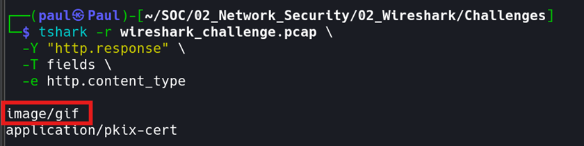

**Answer:** `image/gif`

---

### Q7 — What are the actual magic bytes of the downloaded file?

**Step 1 — Export HTTP objects from the PCAP:**
```bash
tshark -r wireshark_challenge.pcap --export-objects http,./exported_files
```

**Step 2 — List extracted files:**
```bash
ls -lh exported_files/
```

**Step 3 — Inspect the payload:**
```bash
file exported_files/6ctf5JL
xxd exported_files/6ctf5JL | head -3
```

**How It Works:**  
`--export-objects` reconstructs files transferred over HTTP by reassembling TCP stream data and saves each object to disk. One file stands out — `6ctf5JL` at 1.3MB, far larger than everything else (~500 bytes). `xxd` dumps the file's raw binary content as hexadecimal. The very first bytes — known as **magic bytes** or a **file signature** — identify the actual file format regardless of its name, extension, or `Content-Type` header.

> 💡 Every file format reserves its opening bytes as a signature. The OS and security tools use these bytes — not the filename — to determine what a file actually is. You cannot trust the extension or the server's header.

**Magic Bytes Reference:**

| Hex Bytes | ASCII | File Type |
|---|---|---|
| `4D 5A` | `MZ` | **Windows PE Executable (.exe / .dll) ← THIS FILE** |
| `7F 45 4C 46` | `.ELF` | Linux ELF Executable |
| `25 50 44 46` | `%PDF` | PDF Document |
| `50 4B 03 04` | `PK..` | ZIP / Office File |
| `FF D8 FF` | — | JPEG Image |
| `89 50 4E 47` | `.PNG` | PNG Image |

**Screenshot:**

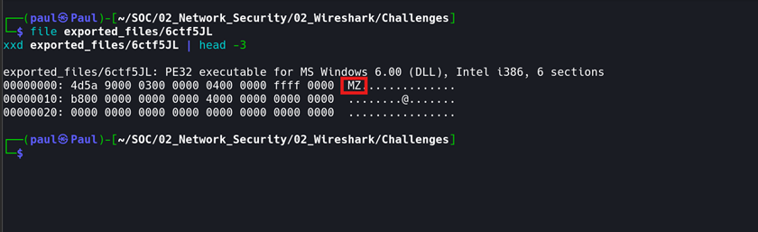

**Answer:** `MZ` (`0x4D 0x5A`) — Windows PE Executable

> The server claimed `image/gif`. The magic bytes revealed a Windows executable. The server lied.

---

### Q8 — What command-line utility was used to download the file?

**Command:**
```bash
tshark -r wireshark_challenge.pcap \
  -Y "http.request" \
  -T fields \
  -e http.user_agent
```

**How It Works:**  
Every HTTP client — browser, curl, wget, PowerShell — identifies itself in the `User-Agent` request header sent with every outbound HTTP request. Extracting `http.user_agent` from the GET request that fetched the payload reveals the exact tool used. A PowerShell User-Agent downloading an executable from a bare IP on a standard workstation is a major red flag — it indicates script-based execution, not a user clicking a link.

| User-Agent String | Tool |
|---|---|
| `curl/7.x.x` | curl |
| `Wget/1.x` | wget |
| `PowerShell / WindowsPowerShell` | PowerShell (Invoke-WebRequest) |
| `Python-urllib/3.x` | Python script |
| `Mozilla/5.0 ...` | Browser |

**Screenshot:**

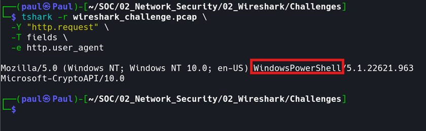

**Answer:** `WindowsPowerShell`

---

### Q9 — What is the SHA256 hash of the downloaded file?

**Command:**
```bash
sha256sum exported_files/6ctf5JL
```

**How It Works:**  
SHA256 produces a unique 64-character fingerprint of a file. Even a single bit change produces a completely different hash — making it the standard identifier for malware samples. Submitting the hash to VirusTotal is safer than uploading the binary since you never transmit the file itself.

**Screenshot:**

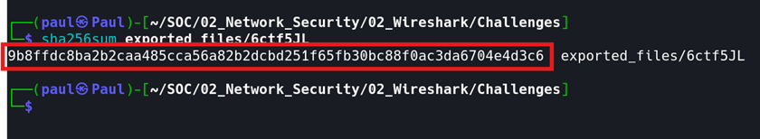

**Answer:** `9b8ffdc8ba2b2caa485cca56a82b2dcbd251f65fb30bc88f0ac3da6704e4d3c6`

---

### Q10 — What type of malware infected the endpoint?

**Method:** SHA256 hash submitted to [VirusTotal](https://www.virustotal.com) via the Search tab. No file upload needed.

**How It Works:**  
VirusTotal aggregates results from 70+ antivirus engines and assigns a Popular threat label based on the most common detection name. The Tags section lists behavioural attributes from sandbox execution. The Family labels section identifies the known malware family.

**VirusTotal Results:**

| Field | Value |
|---|---|
| **Detection Rate** | `59 / 71 vendors (83%)` |
| **Popular Threat Label** | `trojan.pikabot/mikey` |
| **Threat Category** | Trojan |
| **Family Labels** | `pikabot` · `mikey` · `zenpak` |
| **Behaviour Tags** | `pedll` · `spreader` · `overlay` · `checks-user-input` · `detect-debug-environment` · `persistence` |
| **File Size** | 1.23 MB |

**Screenshot:**

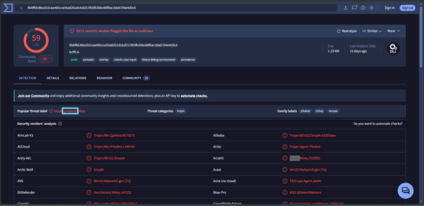

**What is PikaBot?**  
PikaBot is a modular trojan and loader that emerged in early 2023, strongly associated with the **Black Basta ransomware group** as an initial access tool. It loads and executes additional payloads on compromised machines and uses DNS tunneling as its primary C2 channel — directly matching what we observed in the PCAP.

**Answer:** `Trojan — PikaBot (trojan.pikabot/mikey)`

---

### Q11 — What protocol makes up the majority of UDP packets?

**Command:**
```bash
tshark -r wireshark_challenge.pcap \
  -Y "udp" \
  -T fields \
  -e _ws.col.Protocol \
  | sort | uniq -c | sort -rn
```

**How It Works:**  
The `udp` filter isolates all UDP traffic. `_ws.col.Protocol` extracts the highest-level protocol label tshark assigns to each packet. Piping through `sort | uniq -c | sort -rn` produces a ranked frequency table. DNS dominating UDP is expected given the massive C2 beaconing observed — but running the command confirms it with actual counts.

**Screenshot:**

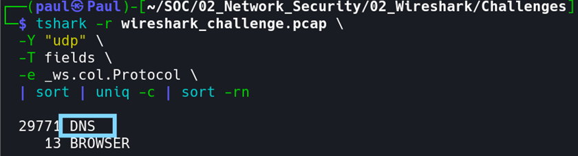

**Answer:** `DNS` (`29,771` packets)

---

### Q12 — What base domain is continually queried? (defanged)

**Command:**
```bash
tshark -r wireshark_challenge.pcap \
  -Y "dns.flags.response == 0" \
  -T fields \
  -e dns.qry.name \
  | sort | uniq -c | sort -rn \
  | head -30
```

**How It Works:**  
`dns.flags.response == 0` isolates outbound DNS queries — what the victim is asking for, not the answers. Ranking by frequency exposes beaconing patterns. Any domain queried thousands of times is automated behaviour. The base domain is the persistent root across all malicious queries; the changing subdomain labels carry encoded C2 data.

**Defanging** replaces dots with `[.]` so the domain cannot be accidentally clicked or resolved when shared in reports:
```
dns.steasteel.net  →  dns.steasteel[.]net
```

**Screenshot:**

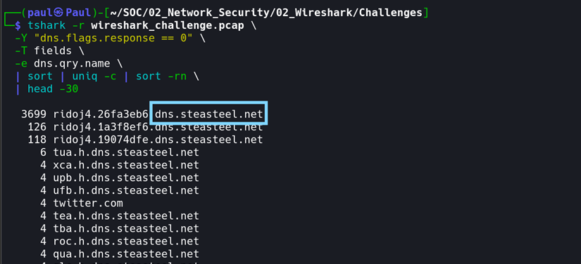

**Answer:** `dns[.]steasteel[.]net`

> 3,699 queries to a single base domain. No IP returned. The data was encoded inside the query labels themselves — not the answers.

---

### Q13 — What attack technique is MITRE ATT&CK T1071.004?

**How It Works:**  
MITRE ATT&CK T1071 covers **Application Layer Protocol** — adversaries communicating using legitimate protocols to blend in with normal traffic. Sub-technique `.004` specifically covers **DNS** as the covert channel. This maps directly to what we observed: malware encoding C2 traffic inside DNS query names, exploiting the fact that port 53 is rarely blocked by firewalls.

**Reference:** https://attack.mitre.org/techniques/T1071/004/

**Evidence Mapping:**

| T1071.004 Indicator | Observed in PCAP |
|---|---|
| High query volume | 3,699+ queries to a single subdomain pattern |
| Algorithmic subdomains | `aaa/baa/caa` sequence then hex-encoded labels |
| No IP returned | Data is in the query label, not the DNS answer |
| Single persistent domain | `dns.steasteel[.]net` constant across all beacons |
| Unusual query rate | Queries firing every few seconds — automated |

**Answer:** `DNS Tunneling — MITRE ATT&CK T1071.004`

---

### 🗺️ Reconstructed Attack Narrative

```
[1] INITIAL CONTACT
    └─ Frame 2: Victim resolved webmasterdev.com → 184.168.98.68

[2] PAYLOAD DELIVERY
    └─ HTTP GET /9GQ5A8/6ctf5JL from bare IP 162.252.172.54
       No domain. No extension. Bypasses URL reputation checks.

[3] DISGUISE DETECTED
    └─ Server Content-Type header claimed: image/gif
       xxd magic bytes revealed: 4D 5A (MZ) = Windows PE executable
       The server lied. The bytes didn't.

[4] MALWARE CONFIRMED
    └─ SHA256 → VirusTotal → 59/71 detections
       Threat label: trojan.pikabot/mikey
       PikaBot — modular loader linked to Black Basta ransomware group

[5] C2 ESTABLISHED
    └─ 3,699+ DNS queries to *.dns.steasteel[.]net
       Changing subdomains carry encoded C2 data
       No IP returned — data is in the query itself
       MITRE ATT&CK T1071.004 — DNS Tunneling
```

---

### 💡 Key Takeaways

**1. Never trust a Content-Type header.**  
The server declared `image/gif`. Magic bytes said `MZ`. Always verify with `xxd` or `file`.

**2. DNS is never just DNS.**  
29,771 DNS packets. 3,699 queries to one base domain. No IP returned.  
That's not name resolution — that's a C2 channel hiding in port 53.

**3. A bare IP as HTTP host is always suspicious.**  
Legitimate services use domain names. A raw IP bypasses URL reputation checks deliberately.

**4. The CLI forces precision.**  
Using `tshark` instead of the GUI forces you to ask specific questions about traffic.  
That precision is exactly what incident response requires.

---

### 📄 Full Report

The complete Q&A investigation report with all terminal screenshots is available in the challenge folder.

---

## 🚧 Coming Soon

- **Email & Phishing Analysis** — header inspection, URL defanging, attachment analysis, CyberChef decoding
- **tcpdump Challenge** — CLI packet capture and filtering
- **Log Analysis** — Splunk/SIEM-based detection challenges

---

## 🔗 Connect

- **LinkedIn:** [Paul Jadefox](https://linkedin.com/in/paul-ukah)
- **AltSchool Africa:** Cloud Security Track — SOC101
- **MalwareCube:** SOC101 Challenge Platform

---

*Built with curiosity and a Kali terminal. One PCAP at a time. 🔐*
