# 🔍 SOC Phishing Email Analysis — Challenge 3

**Module:** `01_Phishing_Analysis/Challenges`  
**File:** `challenge3.eml`  
**Platform:** Kali Linux + Sublime Text  
**Course:** [SOC 101 — MalwareCube Challenges](https://challenges.malwarecube.com/#/c/763f7d78-84c4-465f-9c7d-085e33e21d64)

---

## 📋 Scenario Overview

The Global Logistics SOC received an automated alert from the company's email gateway flagging a suspicious email sent to **Emily Nguyen** (Marketing). The email claimed to originate from **Alexia Barry**, a personal friend of Emily's. As the SOC analyst assigned to this ticket, the objective is to perform a full forensic email analysis and determine whether the email is safe to release or should be escalated.

| Field | Detail |
|---|---|
| Recipient | Emily Nguyen — Marketing Department |
| Claimed Sender | Alexia Barry (personal friend of recipient) |
| Alert Source | Company Email Gateway (auto-quarantine) |
| Challenge File | `01_Phishing_Analysis/Challenges/challenge3.eml` |
| OS / Platform | Kali Linux |
| Primary Viewer | Sublime Text |

---

## 🛠️ Tools Used

| Tool | Purpose |
|---|---|
| Sublime Text | Safe plain-text viewer for raw `.eml` files — no execution risk |
| emldump.py | MIME parser to index and extract email attachments |
| sha256sum | Cryptographic hash generation for threat intelligence lookup |
| VirusTotal | Multi-engine AV scanner and threat intelligence platform |
| oledump.py | OLE stream inspector for analysing VBA macros in Office documents |
| CyberChef | URL defanging |

---

## 3. Installing Sublime Text on Kali Linux

Sublime Text is not included by default on Kali Linux.

### Method 1 — Official apt Repository (Recommended)

```bash
wget -qO - https://download.sublimetext.com/sublimehq-pub.gpg | gpg --dearmor | sudo tee /etc/apt/trusted.gpg.d/sublimehq-archive.gpg > /dev/null

echo "deb https://download.sublimetext.com/ apt/stable/" | sudo tee /etc/apt/sources.list.d/sublime-text.list

sudo apt-get update && sudo apt-get install sublime-text -y
```

### Method 2 — Snap Package

```bash
sudo snap install sublime-text --classic
```

> 💡 The `--classic` flag grants Sublime Text access to files outside the snap sandbox.

### Verify the Installation

```bash
subl --version
```

📸 **Screenshot — verify install**

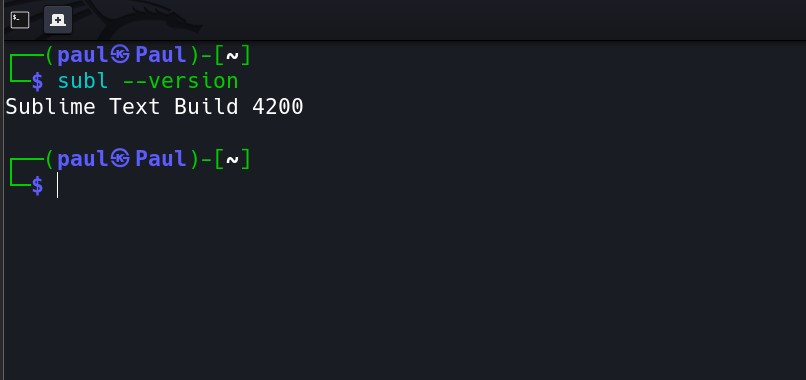

---

## 4. Opening the .eml File in Sublime Text

### From the Terminal

```bash
subl 01_Phishing_Analysis/Challenges/challenge3.eml
```

### From the GUI

1. Launch Sublime Text or type `subl` in the terminal
2. Press **Ctrl+O** → navigate to the Challenges folder → select `challenge3.eml`

> 💡 Opening a `.eml` file in Sublime Text is entirely safe. It reads the file as plain text and will **not** parse, render, or execute any embedded HTML, scripts, links, or macro content.

---

## 5. Navigating the .eml File

The `.eml` file has two sections separated by the first blank line:

- **Section 1 — Headers:** Everything above the first blank line. Key: Value metadata pairs.
- **Section 2 — Body & Attachment:** MIME-encoded body and base64 attachment data.

### Ctrl+F Search Cheat Sheet

| Search Term | Field Located | Answers Question |
|---|---|---|
| `Date:` | Delivery timestamp | Q1 |
| `Subject:` | Email subject line | Q2 |
| `To:` | Recipient name and address | Q3 |
| `From:` | Sender display name + address | Q4 & Q5 |
| `Received:` | Mail server routing chain | Q6 |
| `X-Mailer:` | Sending client / infrastructure | Q6 (supplementary) |
| `Message-ID:` | Unique email identifier | Q7 |
| `filename=` | Attachment filename in MIME | Q9 |

> 🔵 **Sublime Tip:** Press Ctrl+F, type `Received:`, then press **Enter** repeatedly to step through every Received header. The **bottom-most** match is the true origin server.

---

## 6. Email Header Analysis

### Q1 — Date and Time of Email Delivery

> Based on the contents of the email header, what is the full date and time of the email delivery?

In Sublime Text, press **Ctrl+F** and search for `Date:`.

📸 **Screenshot — q1**

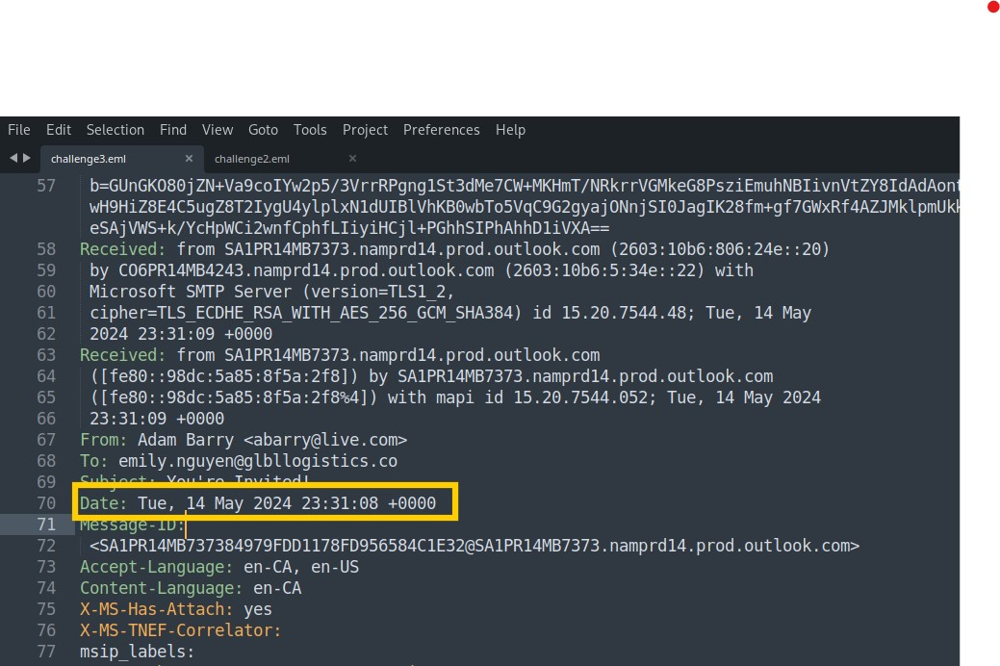

> ✅ **Answer:** `Tue, 14 May 2024 23:31:08 +0000`

---

### Q2 — Email Subject

> What is the subject of the email?

Press **Ctrl+F** and search for `Subject:`.

> 💡 Phishing subjects are crafted for urgency or familiarity — "Your invoice is ready", "Important update", "Hey! Check this out".

📸 **Screenshot — q2**

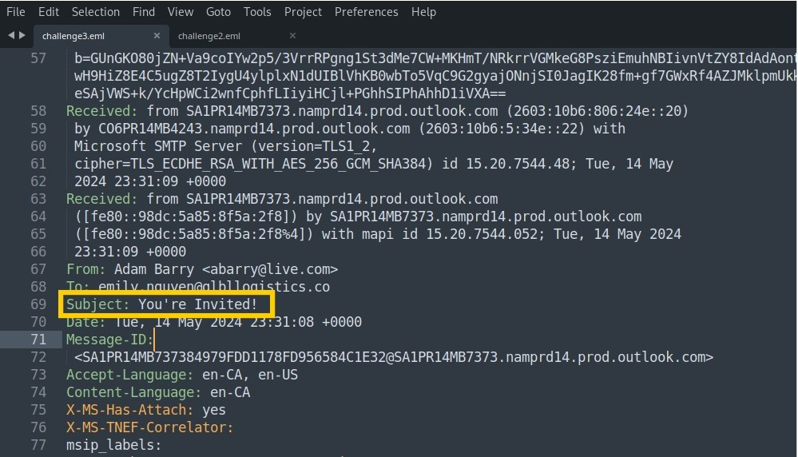

> ✅ **Answer:** `You're Invited!`

---

### Q3 — Email Recipient

> Who was the email sent to?

Press **Ctrl+F** and search for `To:`.

📸 **Screenshot — q3**

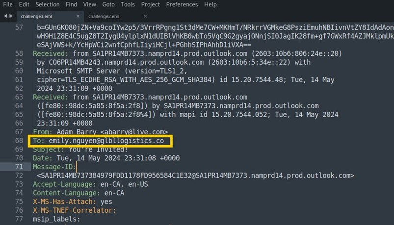

> ✅ **Answer:** `emily.nguyen@glbllogistics.co`

---

### Q4 — Claimed Sender (Display Name)

> Based on the sender's display name, who does the email claim to be from?

Press **Ctrl+F** and search for `From:`.

The `From:` field contains two parts:

| Part | What It Is |
|---|---|
| Display Name (before `<`) | What Emily sees in her inbox |
| Email Address (inside `< >`) | The actual sending address |

> ⚠️ **RED FLAG:** The display name can be set to anything. Attackers impersonate trusted contacts while the real address tells a different story.

📸 **Screenshot — q4**

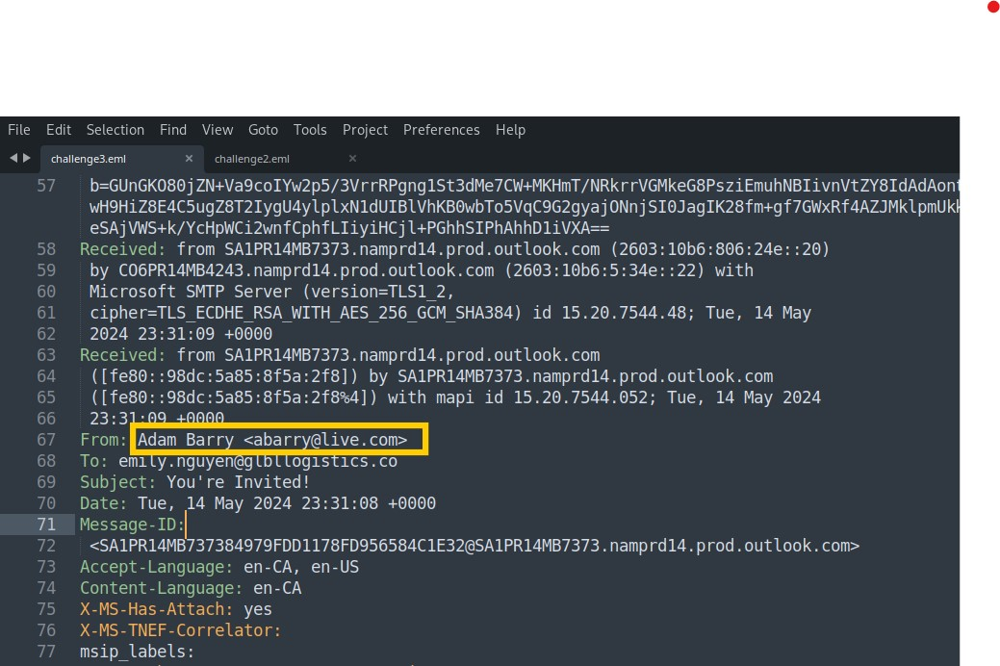

> ✅ **Answer:** `Adam Barry`

---

### Q5 — Actual Sender Email Address

> What is the sender's email address?

Using the same `From:` field, extract the address inside `< >`.

📸 **Screenshot — q5**


> ✅ **Answer:** `abarry@live.com`

---

### Q6 — Email Infrastructure / Provider

> What email infrastructure or provider was used to send the email?

Press **Ctrl+F** and search for `Received:`. Cycle through all matches to reach the **bottom-most** entry — the true origin. Also check for `X-MS-Exchange` headers throughout the file.

To further confirm the provider, run a WHOIS lookup on the originating IP found in the headers:

```bash
whois 2a01:111:f403:2c14::801
```

| Header Pattern | Sending Infrastructure |
|---|---|
| `smtp.gmail.com` | Google Gmail |
| `smtp.mail.yahoo.com` | Yahoo Mail |
| `*.protection.outlook.com` | Microsoft Outlook / Live |
| `sendgrid.net` | SendGrid |
| `amazonses.com` | Amazon SES |

> ⚠️ **RED FLAG:** A legitimate corporate email routes through company mail servers — not a free personal provider like Outlook/Live.

📸 **Screenshot — q6**

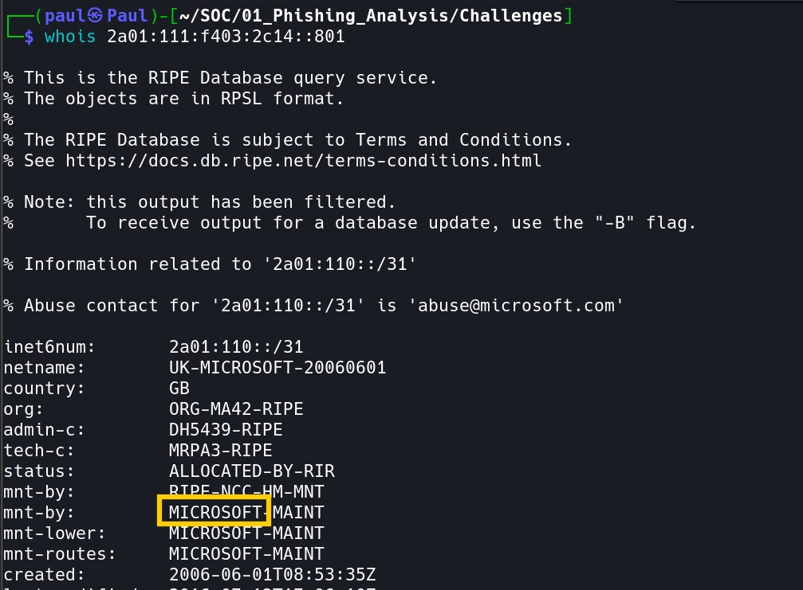

> ✅ **Answer:** `Microsoft`

---

### Q7 — Message ID

> What is the email's Message ID?

Press **Ctrl+F** and search for `Message-ID:`. Copy the full value including `< >`.

> 🔵 **Sublime Tip:** The domain after `@` in the Message-ID independently confirms the sending platform — a second data point corroborating the `Received:` headers.

📸 **Screenshot — q7**

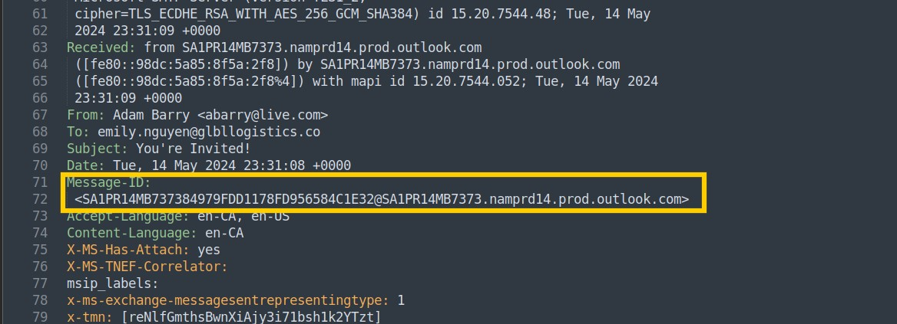

> ✅ **Answer:** `<SA1PR14MB737384979FDD1178FD956584C1E32@SA1PR14MB7373.namprd14.prod.outlook.com>`

---

## 7. Attachment Analysis with emldump.py

While Sublime Text shows the raw MIME structure, `emldump.py` safely parses and extracts the attachment. You can also spot the filename in Sublime Text by pressing **Ctrl+F** and searching for `filename=`.

### Q8 — Attachment Index Number

> Run emldump.py against the email file. Which index number contains the file attachment?

```bash
python3 /path/to/emldump.py challenge3.eml
```

> 💡 Replace `/path/to/emldump.py` with the actual location of the script on your system. If it is in the same directory, simply run `python3 emldump.py challenge3.eml`.

📸 **Screenshot — q8a**

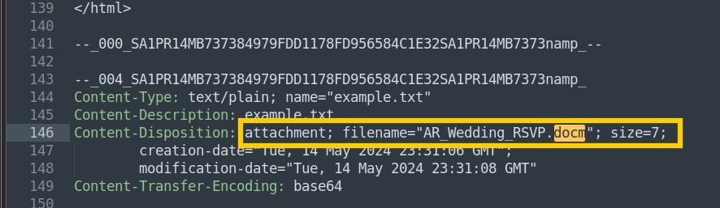

📸 **Screenshot — q8b**

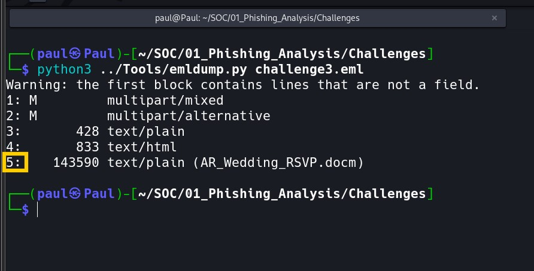

> ✅ **Answer:** `5`

---

### Q9 — Attachment Filename

> What is the filename of the attachment?

The filename appears next to the MIME type in the `emldump.py` output.

> ⚠️ **RED FLAG:** `.docm` is a macro-enabled Word document. These frequently contain embedded VBA macros that execute automatically when opened.

📸 **Screenshot — q9**

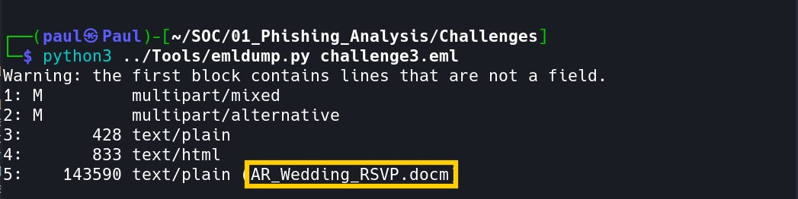

> ✅ **Answer:** `AR_Wedding_RSVP.docm`

---

## 8. Cryptographic Hash Analysis

Extract the attachment using its index number, then generate the SHA-256 hash:

```bash
# Extract the attachment (replace 5 with the correct index number)
python3 /path/to/emldump.py challenge3.eml -s 5 -d > AR_Wedding_RSVP.docm

# Generate the SHA-256 hash
sha256sum AR_Wedding_RSVP.docm
```

📸 **Screenshot — terminal**

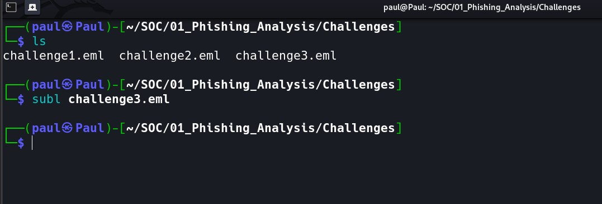

### Q10 — SHA-256 Hash

> What is the SHA-256 hash of the attachment?

The SHA-256 hash is a 64-character hexadecimal fingerprint used to:
- **Uniquely identify** the malware sample
- **Search** VirusTotal and threat intelligence platforms
- **Create hash-based IOCs** to block the file on other endpoints
- **Prove file integrity** — even a 1-byte change produces a completely different hash

📸 **Screenshot — q10**

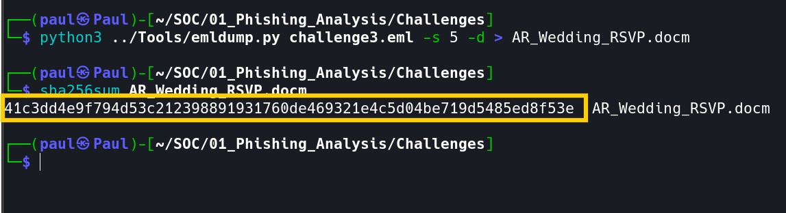

> ✅ **Answer:** `41c3dd4e9f794d53c212398891931760de469321e4c5d04be719d5485ed8f53e`

---

## 9. VirusTotal Threat Intelligence

Navigate to [virustotal.com](https://www.virustotal.com) → click **Search** → paste the SHA-256 hash → press Enter.

| VirusTotal Field | What It Means |
|---|---|
| Detection Ratio | Proportion of engines that flagged the file |
| Popular threat label | Consensus malware name across all vendors |
| File Type | True format (may differ from extension) |
| First Seen | When this sample was first submitted |
| Last Analysis | Most recent multi-engine scan |

### Q11 — Popular Threat Label

> Submit the hash value to VirusTotal. What is the Popular threat label returned for this sample?

> ✅ **Answer:** `trojan.autdwnlrner/w97m`

---

## 10. Final Determination

### Q12 — Should the Email Be Released?

| Finding | Severity | Evidence |
|---|---|---|
| Display name spoofing | CRITICAL | From: display name does not match actual sending address |
| Infrastructure mismatch | CRITICAL | Email routed via personal Outlook/Live, not corporate mail |
| Unexpected attachment | HIGH | `.docm` file with no legitimate business justification |
| Malicious file confirmed | CRITICAL | Hash flagged by multiple AV engines on VirusTotal |
| VBA macro payload | CRITICAL | Macro-enabled document confirmed via oledump.py |

> 🚨 **VERDICT: NO — DO NOT RELEASE.** This is a confirmed phishing attack with a malicious attachment. Maintain quarantine and escalate immediately.

**Recommended Response Actions:**
1. Maintain email quarantine — do not release to Emily's inbox
2. Block `abarry@live.com` and the `live.com` sender domain at the gateway
3. Submit all IOCs to your threat intelligence platform
4. Notify Emily Nguyen that a phishing email impersonating a friend was intercepted
5. Search mail logs for similar emails sent to other staff members
6. If Emily had prior contact with this sender, check her endpoint for compromise

---

## 11. Bonus — Static VBA Macro Analysis with oledump.py

### List All OLE Streams

```bash
python3 /path/to/oledump.py AR_Wedding_RSVP.docm
```

Look for streams marked with **`M`** — these contain macro code.

### Extract the Macro (Stream A3)

```bash
python3 /path/to/oledump.py AR_Wedding_RSVP.docm -s A3 -v
```

| VBA Pattern | What It Does |
|---|---|
| `URLDownloadToFile` | Downloads a remote file to a local path on disk |
| `Shell / WScript.Shell` | Executes a system command or runs the downloaded payload |
| `http://` or `https://` | Hardcoded attacker-controlled download URL |
| `Environ("TEMP")` | Drops payload to the user's Temp directory |
| `AutoOpen / Auto_Open` | Macro executes automatically when the document is opened |

---

### Bonus Q1 — Download URL (Defanged)

> What URL does the malware attempt to download an executable from? Provide the URL in defanged format.

The URL is found inside the `URLDownloadToFile` call in the macro output.

To defang, use [CyberChef](https://gchq.github.io/CyberChef/) → drag in the **Defang URL** recipe → paste the URL.

📸 **Screenshot — bq1a**

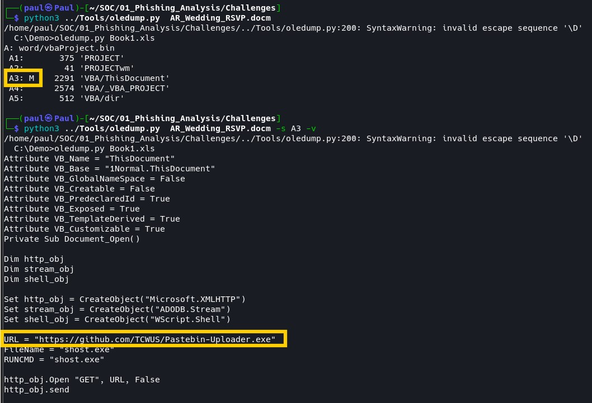

📸 **Screenshot — bq1b**

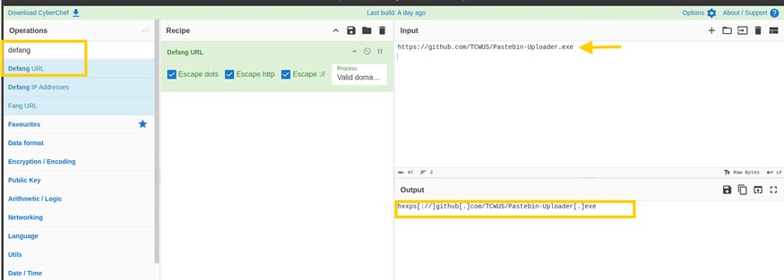

> ✅ **Answer:** `hxxps[://]github[.]com/TCWUS/Pastebin-Uploader[.]exe`

---

### Bonus Q2 — Executable Filename

> What is the filename used by the macro to save the executable?

The save path is in the second argument of `URLDownloadToFile`. The filename follows the last `\` in the path string.

📸 **Screenshot — bq2**

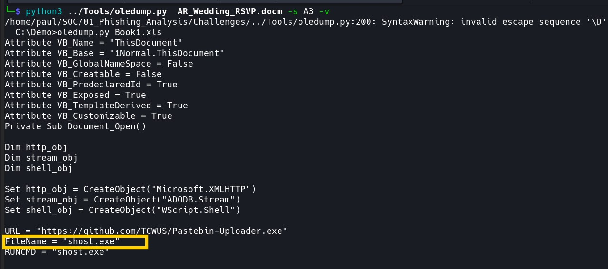

> ✅ **Answer:** `shost.exe`

---

## 12. Indicators of Compromise (IOC) Summary

| IOC Type | Value |
|---|---|
| Sender Display Name | `Adam Barry` |
| Sender Email Address | `abarry@live.com` |
| Email Subject | `You're Invited!` |
| Sending Infrastructure | `Microsoft (Outlook / Live)` |
| Message-ID | `<SA1PR14MB737384979FDD1178FD956584C1E32@SA1PR14MB7373.namprd14.prod.outlook.com>` |
| Attachment Filename | `AR_Wedding_RSVP.docm` |
| SHA-256 Hash | `41c3dd4e9f794d53c212398891931760de469321e4c5d04be719d5485ed8f53e` |
| VirusTotal Threat Label | `trojan.autdwnlrner/w97m` |
| C2 Download URL (defanged) | `hxxps[://]github[.]com/TCWUS/Pastebin-Uploader[.]exe` |
| Dropped Executable Name | `shost.exe` |

---

## 13. Key Takeaways

- **Always inspect raw email headers** — display names are trivially spoofed and cannot be trusted
- **Sublime Text is an ideal safe viewer** — reads `.eml` files as plain text with zero execution risk
- **Use Ctrl+F to navigate efficiently** — searching field names is faster than scrolling
- **Check the Message-ID domain** — it independently confirms the true sending platform
- **Never trust unexpected attachments** — even when the sender appears to be a known contact
- **Hash before analysing** — SHA-256 preserves integrity and enables threat intelligence lookups
- **Use oledump.py for macro analysis** — never open malicious Office files directly
- **Always defang URLs and IPs** — prevents accidental access when sharing IOCs in reports

---

## 🔗 Connect
- **LinkedIn:** [Paul Jadefox](https://linkedin.com/in/paul-ukah)
- **AltSchool Africa:** Cloud Security Track — SOC101
- **MalwareCube:** SOC101 Challenge Platform

*Tools: Kali Linux · Sublime Text · emldump.py · sha256sum · oledump.py · VirusTotal · CyberChef*
